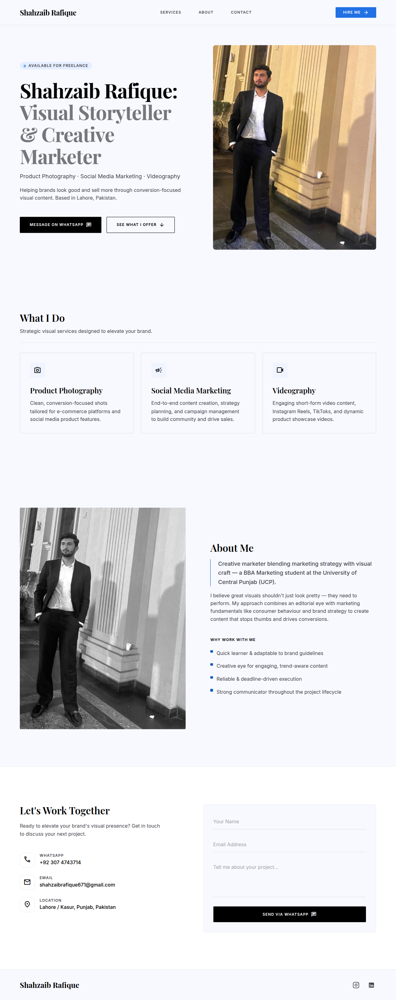
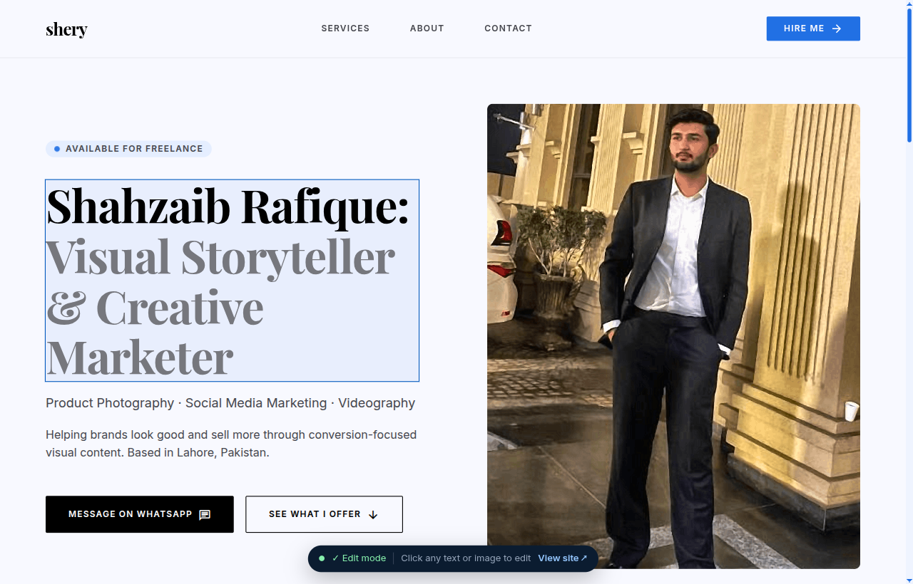

# Shahzaib Rafique — Portfolio

A single-page portfolio for **Shahzaib Rafique**, a creative marketer and visual storyteller based in Lahore, Pakistan — specializing in product photography, social media marketing, and videography.



## Overview

A fast, fully responsive static site (everything in `public/`). No build step and no dependencies to install. The contact form opens WhatsApp with the message pre-filled, so the live site works without a backend.

## Features

- **Inline visual editing** — edit text, images, services, social links & nav right on the page (`?edit=1`), Framer-style; no code required
- **Content-driven** — all text, images, and links live in `public/content.json`; the site reads from it on load
- **Mobile-first responsive layout** — built with Tailwind utility classes, single `md:` breakpoint
- **Accessible** — skip link, semantic landmarks, labelled sections, visible focus rings, `inert` mobile menu, `prefers-reduced-motion` support
- **SEO-ready** — unique title & meta description, Open Graph + Twitter Card tags, canonical URL, and `Person` JSON-LD structured data
- **No backend for the live site** — the contact form deep-links to WhatsApp with a pre-filled message

## Sections

| Section | Content |
|---------|---------|
| Hero | Intro, availability badge, and primary call-to-action |
| Services | Product Photography · Social Media Marketing · Videography |
| About | Background, approach, and "why work with me" |
| Contact | WhatsApp / email / location, plus a WhatsApp contact form |

## Tech Stack

- HTML5
- [Tailwind CSS](https://tailwindcss.com/) (via CDN)
- Vanilla JavaScript (mobile menu + form handling)
- Google Fonts — Playfair Display & Inter; Material Symbols for icons

## Getting Started

The deployable site is the **`public/`** folder. Serve it locally:

```bash
# Node (recommended — also powers the editor)
node tools/server.js
# then visit http://localhost:4321/index.html

# …or any static server, pointed at public/
python3 -m http.server 8000 --directory public
# then visit http://localhost:8000
```

## Editing content

All content lives in **`public/content.json`**. Start the bundled Node server first (no `npm install` — Node's built-ins only):

```bash
node tools/server.js
# (port 4321 in use? run:  PORT=4500 node tools/server.js)
```

There are two ways to edit, both auto-saving to `public/content.json`.

### Option A — Edit directly on the page (recommended)

Open **http://localhost:4321/index.html?edit=1**

- **Click any text** on the site to edit it in place; click away to save.
- **Click any image** (hero / about) to upload a replacement — it's saved into `public/assets/` and wired up automatically.
- Hover a **service card** or **"why" point** to reveal a **✕** to remove it; use **+ Add** to add one.
- **Nav labels** are editable in place; **social links** can be clicked to set their network + URL, with **+ Add** / **✕** to manage them.
- A toolbar at the bottom shows the save status. The public site (`index.html`, no `?edit=1`) shows none of this — the contact form is also locked while editing.



### Option B — Edit the JSON by hand

Open `public/content.json` in any text editor, change values, and reload. (Must be served over http — browsers block `fetch()` of `file://`.)

> If `content.json` can't be loaded, `index.html` falls back to its built-in default text, so the site never looks broken.

## Customization

Before going live, replace the placeholder values:

- `public/index.html` — set the real domain in the `og:url`, `canonical`, and JSON-LD `url` fields (currently `https://example.com/`)
- `public/index.html` — replace the placeholder `og:image` / `twitter:image` with a hosted 1200×630 share image
- Use the editor (or `public/content.json`) to set the final hero/about photo

> **Hosting note:** deploy the **`public/`** folder — it's fully static and works anywhere (GitHub Pages, Netlify, Vercel). The `tools/` folder (`server.js`) holds the **dev-only editor server** — you don't deploy it.

## Project Structure

```
.
├── public/                 # ← deploy THIS folder (the live site)
│   ├── index.html          #   the site + inline editor (reads content.json)
│   ├── content.json        #   all editable text, images, and links
│   └── assets/
│       └── shahzaib.png    #   hero & about portrait (+ uploads land here)
├── tools/                  # dev-only (not deployed)
│   └── server.js           #   tiny Node server (powers ?edit=1 save + upload)
├── docs/                   # screenshots used in this README
│   ├── preview.png
│   └── edit-preview.png
└── readme.md
```

## Contact

- **WhatsApp:** +92 307 4743714
- **Email:** shahzaibrafique671@gmail.com
- **Instagram:** [@i_em_shahzaib_06](https://www.instagram.com/i_em_shahzaib_06)
- **LinkedIn:** [Shahzaib Rafique](https://pk.linkedin.com/in/shahzaib-rafique-34303435b)
