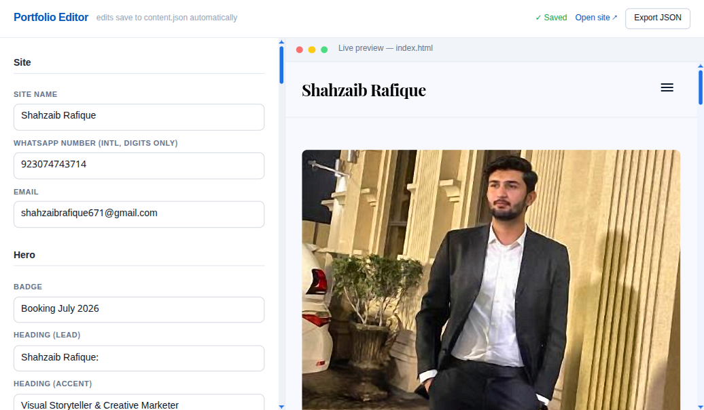

# Shahzaib Rafique — Portfolio

A single-page portfolio for **Shahzaib Rafique**, a creative marketer and visual storyteller based in Lahore, Pakistan — specializing in product photography, social media marketing, and videography.


## Overview

A fast, fully responsive, single-file static site. No build step, no dependencies to install — just open it in a browser. The contact form opens WhatsApp with the message pre-filled, so the site works without a backend.

## Features

- **Visual editor** — a WordPress/Framer-style editor (`editor.html`) to edit all text and images with a live preview; no code required
- **Content-driven** — all text, images, and links live in `content.json`; the site reads from it on load
- **Mobile-first responsive layout** — built with Tailwind utility classes, single `md:` breakpoint
- **Accessible** — skip link, semantic landmarks, labelled sections, visible focus rings, `inert` mobile menu, `prefers-reduced-motion` support
- **SEO-ready** — unique title & meta description, Open Graph + Twitter Card tags, canonical URL, and `Person` JSON-LD structured data
- **No backend for the live site** — the contact form deep-links to WhatsApp with a pre-filled message

## Sections

| Section | Content |
|---------|---------|
| Hero | Intro, availability badge, and primary call-to-action |
| Services | Product Photography · Social Media Marketing · Videography |
| About | Background, approach, and "why work with me" |
| Contact | WhatsApp / email / location, plus a WhatsApp contact form |

## Tech Stack

- HTML5
- [Tailwind CSS](https://tailwindcss.com/) (via CDN)
- Vanilla JavaScript (mobile menu + form handling)
- Google Fonts — Playfair Display & Inter; Material Symbols for icons

## Getting Started

The site is a single `index.html` file. Open it directly, or serve it locally:

```bash
# Python
python3 -m http.server 8000
# then visit http://localhost:8000
```

## Editing content

All content lives in **`content.json`**. There are two ways to edit it.

### Option A — Visual editor (recommended)

A WordPress-style editor with a live preview. It needs the bundled Node server (no `npm install` — Node's built-ins only).

```bash
node server.js
# then open http://localhost:4321/editor.html
```



- Edit any field on the left; changes **auto-save** to `content.json` and the preview refreshes.
- Click **Upload image** to add a hero/about photo — it's saved into the folder and wired up automatically.
- Add or remove services, "why" points, social links, and nav items with the **+ Add** / **✕** buttons.
- **Export JSON** downloads a copy of `content.json` (handy for backups or static hosting).

### Option B — Edit the JSON by hand

Open `content.json` in any text editor and change the values. Then serve the site over http (the browser blocks `fetch()` of local files via `file://`):

```bash
python3 -m http.server 8000   # then visit http://localhost:8000
```

> If `content.json` can't be loaded, `index.html` falls back to its built-in default text, so the site never looks broken.

## Customization

Before going live, replace the placeholder values:

- `index.html` — set the real domain in the `og:url`, `canonical`, and JSON-LD `url` fields (currently `https://example.com/`)
- `index.html` — replace the placeholder `og:image` / `twitter:image` with a hosted 1200×630 share image
- Use the editor (or `content.json`) to set the final hero/about photo

> **Hosting note:** the live site (`index.html` + `content.json`) is fully static and deploys anywhere (GitHub Pages, Netlify, Vercel). `server.js` and `editor.html` are **dev-only authoring tools** — you don't deploy them.

## Project Structure

```
.
├── index.html          # The live site (reads content.json)
├── content.json        # All editable text, images, and links
├── editor.html         # Visual editor (dev-only)
├── server.js           # Tiny Node server powering the editor (dev-only)
├── shahzaib.png        # Hero & about portrait
├── preview.png         # Site screenshot (README)
├── editor-preview.png  # Editor screenshot (README)
└── readme.md
```

## Contact

- **WhatsApp:** +92 307 4743714
- **Email:** shahzaibrafique671@gmail.com
- **Instagram:** [@i_em_shahzaib_06](https://www.instagram.com/i_em_shahzaib_06)
- **LinkedIn:** [Shahzaib Rafique](https://pk.linkedin.com/in/shahzaib-rafique-34303435b)
